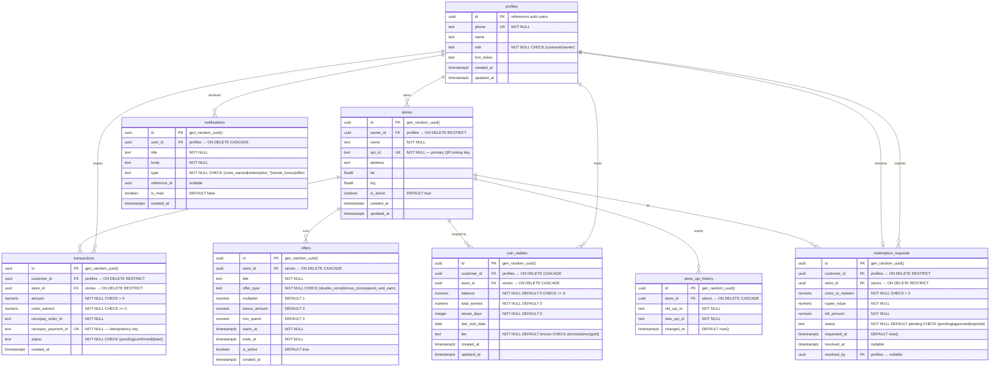

# Sikka — Complete Database Schema

## Business logic constants

| Constant | Value |
|---|---|
| Earn rate | 5% of spend = coins earned |
| Redeem rate | 2 coins = ₹1 |
| Max redemption | 20% of bill value |
| Bronze → Silver | 200 total coins earned |
| Silver → Gold | 500 total coins earned |
| 3-day streak bonus | 10 coins |
| 7-day streak bonus | 25 coins |

---

## 1. Mermaid ER diagram



### Relationship cardinality summary

| From | To | Cardinality | Meaning |
|---|---|---|---|
| profiles | stores | 1 → 0..* | One owner can have many stores |
| profiles | transactions | 1 → 0..* | One customer can make many transactions |
| profiles | coin_wallets | 1 → 0..* | One customer can have wallets at many stores |
| profiles | redemption_requests | 1 → 0..* | One customer can submit many requests |
| profiles | redemption_requests (resolved_by) | 1 → 0..1 | One owner resolves zero or one request per row |
| profiles | notifications | 1 → 0..* | One user can receive many notifications |
| stores | transactions | 1 → 0..* | One store receives many transactions |
| stores | coin_wallets | 1 → 0..* | One store has many customer wallets |
| stores | redemption_requests | 1 → 0..* | One store receives many redemption requests |
| stores | offers | 1 → 0..* | One store can run many offers |
| stores | store_upi_history | 1 → 0..* | One store can have many UPI changes |
| coin_wallets | (customer_id, store_id) | UNIQUE | One wallet per customer per store |

---

## 2. CREATE TABLE statements

```sql
-- ============================================================
-- Sikka: Complete DDL for Supabase (Postgres 15+)
-- Run in order — foreign keys depend on earlier tables.
-- ============================================================

-- Enable pgcrypto for gen_random_uuid() if not already enabled
CREATE EXTENSION IF NOT EXISTS "pgcrypto";

-- -------------------------------------------------------
-- Table 1: profiles (extends Supabase auth.users)
-- -------------------------------------------------------
CREATE TABLE profiles (
  id          uuid        PRIMARY KEY REFERENCES auth.users ON DELETE CASCADE,
  phone       text        UNIQUE NOT NULL,
  name        text,
  role        text        NOT NULL CHECK (role IN ('customer', 'owner')),
  fcm_token   text,
  created_at  timestamptz NOT NULL DEFAULT now(),
  updated_at  timestamptz NOT NULL DEFAULT now()
);

COMMENT ON TABLE  profiles              IS 'Extends Supabase auth.users. One row per authenticated user.';
COMMENT ON COLUMN profiles.role         IS 'customer = shopper, owner = kirana store owner';
COMMENT ON COLUMN profiles.fcm_token    IS 'Firebase Cloud Messaging token for push notifications';

-- -------------------------------------------------------
-- Table 2: stores
-- -------------------------------------------------------
CREATE TABLE stores (
  id          uuid              PRIMARY KEY DEFAULT gen_random_uuid(),
  owner_id    uuid              NOT NULL REFERENCES profiles (id) ON DELETE RESTRICT,
  name        text              NOT NULL,
  upi_id      text              UNIQUE NOT NULL,
  address     text,
  lat         double precision,
  lng         double precision,
  is_active   boolean           NOT NULL DEFAULT true,
  created_at  timestamptz       NOT NULL DEFAULT now(),
  updated_at  timestamptz       NOT NULL DEFAULT now()
);

COMMENT ON TABLE  stores            IS 'Each kirana store registered on Sikka.';
COMMENT ON COLUMN stores.upi_id     IS 'Primary lookup key after customer scans QR code.';
COMMENT ON COLUMN stores.owner_id   IS 'ON DELETE RESTRICT: cannot delete an owner who has stores.';

-- -------------------------------------------------------
-- Table 3: transactions
-- -------------------------------------------------------
CREATE TABLE transactions (
  id                    uuid        PRIMARY KEY DEFAULT gen_random_uuid(),
  customer_id           uuid        NOT NULL REFERENCES profiles (id) ON DELETE RESTRICT,
  store_id              uuid        NOT NULL REFERENCES stores  (id) ON DELETE RESTRICT,
  amount                numeric     NOT NULL CHECK (amount > 0),
  coins_earned          numeric     NOT NULL CHECK (coins_earned >= 0),
  razorpay_order_id     text        NOT NULL,
  razorpay_payment_id   text        UNIQUE NOT NULL,
  status                text        NOT NULL CHECK (status IN ('pending', 'confirmed', 'failed')),
  created_at            timestamptz NOT NULL DEFAULT now()
);

COMMENT ON TABLE  transactions                       IS 'Every UPI payment made through the Sikka app.';
COMMENT ON COLUMN transactions.razorpay_payment_id   IS 'UNIQUE constraint prevents double coin awards (idempotency key).';
COMMENT ON COLUMN transactions.coins_earned          IS 'Computed as amount * 0.05 (5% earn rate).';
COMMENT ON COLUMN transactions.customer_id           IS 'ON DELETE RESTRICT: cannot delete customer with transaction history.';
COMMENT ON COLUMN transactions.store_id              IS 'ON DELETE RESTRICT: cannot delete store with transaction history.';

-- -------------------------------------------------------
-- Table 4: coin_wallets
-- -------------------------------------------------------
CREATE TABLE coin_wallets (
  id              uuid        PRIMARY KEY DEFAULT gen_random_uuid(),
  customer_id     uuid        NOT NULL REFERENCES profiles (id) ON DELETE CASCADE,
  store_id        uuid        NOT NULL REFERENCES stores  (id) ON DELETE CASCADE,
  balance         numeric     NOT NULL DEFAULT 0 CHECK (balance >= 0),
  total_earned    numeric     NOT NULL DEFAULT 0,
  streak_days     integer     NOT NULL DEFAULT 0,
  last_visit_date date,
  tier            text        NOT NULL DEFAULT 'bronze'
                              CHECK (tier IN ('bronze', 'silver', 'gold')),
  created_at      timestamptz NOT NULL DEFAULT now(),
  updated_at      timestamptz NOT NULL DEFAULT now(),

  UNIQUE (customer_id, store_id)
);

COMMENT ON TABLE  coin_wallets              IS 'Per-customer-per-store wallet. Coins are isolated to each store.';
COMMENT ON COLUMN coin_wallets.balance      IS 'Current redeemable coin balance. 2 coins = ₹1.';
COMMENT ON COLUMN coin_wallets.total_earned IS 'Lifetime coins earned. Drives tier: bronze <200, silver 200-499, gold 500+.';
COMMENT ON COLUMN coin_wallets.streak_days  IS 'Consecutive visit days. 3-day = 10 bonus coins, 7-day = 25 bonus coins.';
COMMENT ON COLUMN coin_wallets.tier         IS 'Computed from total_earned: bronze (0-199), silver (200-499), gold (500+).';

-- -------------------------------------------------------
-- Table 5: redemption_requests
-- -------------------------------------------------------
CREATE TABLE redemption_requests (
  id               uuid        PRIMARY KEY DEFAULT gen_random_uuid(),
  customer_id      uuid        NOT NULL REFERENCES profiles (id) ON DELETE RESTRICT,
  store_id         uuid        NOT NULL REFERENCES stores  (id) ON DELETE RESTRICT,
  coins_to_redeem  numeric     NOT NULL CHECK (coins_to_redeem > 0),
  rupee_value      numeric     NOT NULL,
  bill_amount      numeric     NOT NULL,
  status           text        NOT NULL DEFAULT 'pending'
                               CHECK (status IN ('pending', 'approved', 'rejected')),
  requested_at     timestamptz NOT NULL DEFAULT now(),
  resolved_at      timestamptz,
  resolved_by      uuid        REFERENCES profiles (id)
);

COMMENT ON TABLE  redemption_requests                IS 'Customer requests to redeem coins; store owner approves or rejects.';
COMMENT ON COLUMN redemption_requests.rupee_value    IS 'coins_to_redeem / 2. Max 20% of bill_amount.';
COMMENT ON COLUMN redemption_requests.resolved_by    IS 'The store owner who approved/rejected. NULL while pending.';
COMMENT ON COLUMN redemption_requests.customer_id    IS 'ON DELETE RESTRICT: cannot delete customer with pending requests.';

-- -------------------------------------------------------
-- Table 6: offers
-- -------------------------------------------------------
CREATE TABLE offers (
  id           uuid        PRIMARY KEY DEFAULT gen_random_uuid(),
  store_id     uuid        NOT NULL REFERENCES stores (id) ON DELETE CASCADE,
  title        text        NOT NULL,
  offer_type   text        NOT NULL CHECK (offer_type IN ('double_coins', 'bonus_coins', 'spend_and_earn')),
  multiplier   numeric     NOT NULL DEFAULT 1,
  bonus_amount numeric     NOT NULL DEFAULT 0,
  min_spend    numeric     NOT NULL DEFAULT 0,
  starts_at    timestamptz NOT NULL,
  ends_at      timestamptz NOT NULL,
  is_active    boolean     NOT NULL DEFAULT true,
  created_at   timestamptz NOT NULL DEFAULT now()
);

COMMENT ON TABLE  offers            IS 'Timed promotional offers created by store owners.';
COMMENT ON COLUMN offers.offer_type IS 'double_coins: 2x earn rate. bonus_coins: flat bonus. spend_and_earn: min_spend threshold.';
COMMENT ON COLUMN offers.multiplier IS 'Coin multiplier for double_coins offers (e.g. 2.0).';

-- -------------------------------------------------------
-- Table 7: notifications
-- -------------------------------------------------------
CREATE TABLE notifications (
  id           uuid        PRIMARY KEY DEFAULT gen_random_uuid(),
  user_id      uuid        NOT NULL REFERENCES profiles (id) ON DELETE CASCADE,
  title        text        NOT NULL,
  body         text        NOT NULL,
  type         text        NOT NULL CHECK (type IN (
                             'coins_earned',
                             'redemption_requested',
                             'redemption_confirmed',
                             'redemption_rejected',
                             'streak_bonus',
                             'offer'
                           )),
  reference_id uuid,
  is_read      boolean     NOT NULL DEFAULT false,
  created_at   timestamptz NOT NULL DEFAULT now()
);

COMMENT ON TABLE  notifications              IS 'In-app notification feed for customers and store owners.';
COMMENT ON COLUMN notifications.reference_id IS 'Polymorphic FK: points to transaction, redemption, or offer depending on type.';

-- -------------------------------------------------------
-- Table 8: store_upi_history
-- -------------------------------------------------------
CREATE TABLE store_upi_history (
  id          uuid        PRIMARY KEY DEFAULT gen_random_uuid(),
  store_id    uuid        NOT NULL REFERENCES stores (id) ON DELETE CASCADE,
  old_upi_id  text        NOT NULL,
  new_upi_id  text        NOT NULL,
  changed_at  timestamptz NOT NULL DEFAULT now()
);

COMMENT ON TABLE store_upi_history IS 'Audit log of UPI ID changes for a store.';
```

---

## 3. CREATE INDEX statements

```sql
-- ============================================================
-- Indexes — organized by the three critical lookup paths,
-- then general performance indexes.
-- ============================================================

-- -------------------------------------------------------
-- CRITICAL PATH 1: Store lookup after QR scan
-- Customer scans a UPI QR → app looks up store by upi_id.
-- The UNIQUE constraint on stores.upi_id already creates
-- a unique B-tree index, so no additional index is needed.
-- -------------------------------------------------------
-- (Covered by: UNIQUE (upi_id) on stores)

-- -------------------------------------------------------
-- CRITICAL PATH 2: Wallet lookup (customer_id + store_id)
-- After identifying the store, the app fetches or creates
-- the customer's wallet for that store.
-- The UNIQUE constraint on (customer_id, store_id) already
-- creates a composite unique B-tree index.
-- -------------------------------------------------------
-- (Covered by: UNIQUE (customer_id, store_id) on coin_wallets)

-- -------------------------------------------------------
-- CRITICAL PATH 3: Idempotency check on razorpay_payment_id
-- Before awarding coins, check if this payment was already
-- processed. The UNIQUE constraint handles this.
-- -------------------------------------------------------
-- (Covered by: UNIQUE (razorpay_payment_id) on transactions)

-- -------------------------------------------------------
-- stores indexes
-- -------------------------------------------------------
-- Owner dashboard: list all stores belonging to an owner
CREATE INDEX idx_stores_owner_id ON stores (owner_id);

-- -------------------------------------------------------
-- transactions indexes
-- -------------------------------------------------------
-- Customer history: list all transactions for a customer
CREATE INDEX idx_transactions_customer_id ON transactions (customer_id);

-- Store dashboard: list all transactions at a store, newest first
CREATE INDEX idx_transactions_store_id_created_at ON transactions (store_id, created_at DESC);

-- Razorpay webhook reconciliation: look up by order ID
CREATE INDEX idx_transactions_razorpay_order_id ON transactions (razorpay_order_id);

-- -------------------------------------------------------
-- coin_wallets indexes
-- -------------------------------------------------------
-- Store dashboard: list all customer wallets for a store
CREATE INDEX idx_coin_wallets_store_id ON coin_wallets (store_id);

-- -------------------------------------------------------
-- redemption_requests indexes
-- -------------------------------------------------------
-- Customer view: all my redemption requests
CREATE INDEX idx_redemption_requests_customer_id ON redemption_requests (customer_id);

-- Store owner queue: pending requests at my store
CREATE INDEX idx_redemption_requests_store_id_status ON redemption_requests (store_id, status);

-- -------------------------------------------------------
-- offers indexes
-- -------------------------------------------------------
-- Active offers: find current offers for a store
CREATE INDEX idx_offers_store_id_active ON offers (store_id)
  WHERE is_active = true;

-- Time-based offer query: starts_at and ends_at for overlap checks
CREATE INDEX idx_offers_store_id_time ON offers (store_id, starts_at, ends_at);

-- -------------------------------------------------------
-- notifications indexes
-- -------------------------------------------------------
-- User notification feed: newest first, unread first
CREATE INDEX idx_notifications_user_id_created_at ON notifications (user_id, created_at DESC);

-- Unread count badge
CREATE INDEX idx_notifications_user_id_unread ON notifications (user_id)
  WHERE is_read = false;

-- -------------------------------------------------------
-- store_upi_history indexes
-- -------------------------------------------------------
-- Audit trail for a specific store
CREATE INDEX idx_store_upi_history_store_id ON store_upi_history (store_id);
```

---

## 4. Row Level Security (RLS) policies

```sql
-- ============================================================
-- Row Level Security policies
-- All tables use auth.uid() to identify the current user.
-- ============================================================

-- -------------------------------------------------------
-- Enable RLS on every table
-- -------------------------------------------------------
ALTER TABLE profiles             ENABLE ROW LEVEL SECURITY;
ALTER TABLE stores               ENABLE ROW LEVEL SECURITY;
ALTER TABLE transactions         ENABLE ROW LEVEL SECURITY;
ALTER TABLE coin_wallets         ENABLE ROW LEVEL SECURITY;
ALTER TABLE redemption_requests  ENABLE ROW LEVEL SECURITY;
ALTER TABLE offers               ENABLE ROW LEVEL SECURITY;
ALTER TABLE notifications        ENABLE ROW LEVEL SECURITY;
ALTER TABLE store_upi_history    ENABLE ROW LEVEL SECURITY;

-- -------------------------------------------------------
-- profiles: users can read and update only their own row
-- -------------------------------------------------------
CREATE POLICY profiles_select_own ON profiles
  FOR SELECT USING (id = auth.uid());

CREATE POLICY profiles_update_own ON profiles
  FOR UPDATE USING (id = auth.uid())
  WITH CHECK (id = auth.uid());

CREATE POLICY profiles_insert_own ON profiles
  FOR INSERT WITH CHECK (id = auth.uid());

-- -------------------------------------------------------
-- stores: any authenticated user can read;
--         only the owner can insert or update
-- -------------------------------------------------------
CREATE POLICY stores_select_all ON stores
  FOR SELECT USING (auth.role() = 'authenticated');

CREATE POLICY stores_insert_owner ON stores
  FOR INSERT WITH CHECK (owner_id = auth.uid());

CREATE POLICY stores_update_owner ON stores
  FOR UPDATE USING (owner_id = auth.uid())
  WITH CHECK (owner_id = auth.uid());

-- -------------------------------------------------------
-- transactions: customers see their own;
--               store owners see all at their store
-- -------------------------------------------------------
CREATE POLICY transactions_select_customer ON transactions
  FOR SELECT USING (customer_id = auth.uid());

CREATE POLICY transactions_select_owner ON transactions
  FOR SELECT USING (
    store_id IN (SELECT id FROM stores WHERE owner_id = auth.uid())
  );

CREATE POLICY transactions_insert_customer ON transactions
  FOR INSERT WITH CHECK (customer_id = auth.uid());

-- -------------------------------------------------------
-- coin_wallets: customers see their own wallets;
--              store owners see all wallets for their store
-- -------------------------------------------------------
CREATE POLICY coin_wallets_select_customer ON coin_wallets
  FOR SELECT USING (customer_id = auth.uid());

CREATE POLICY coin_wallets_select_owner ON coin_wallets
  FOR SELECT USING (
    store_id IN (SELECT id FROM stores WHERE owner_id = auth.uid())
  );

-- Wallets are created/updated by server-side functions, not directly.
-- Grant insert/update only through service_role or database functions.
CREATE POLICY coin_wallets_insert_system ON coin_wallets
  FOR INSERT WITH CHECK (customer_id = auth.uid());

CREATE POLICY coin_wallets_update_system ON coin_wallets
  FOR UPDATE USING (customer_id = auth.uid());

-- -------------------------------------------------------
-- redemption_requests: customers see their own;
--                      store owners see all for their store
-- -------------------------------------------------------
CREATE POLICY redemption_requests_select_customer ON redemption_requests
  FOR SELECT USING (customer_id = auth.uid());

CREATE POLICY redemption_requests_select_owner ON redemption_requests
  FOR SELECT USING (
    store_id IN (SELECT id FROM stores WHERE owner_id = auth.uid())
  );

CREATE POLICY redemption_requests_insert_customer ON redemption_requests
  FOR INSERT WITH CHECK (customer_id = auth.uid());

-- Only store owner can approve/reject (update status)
CREATE POLICY redemption_requests_update_owner ON redemption_requests
  FOR UPDATE USING (
    store_id IN (SELECT id FROM stores WHERE owner_id = auth.uid())
  )
  WITH CHECK (
    store_id IN (SELECT id FROM stores WHERE owner_id = auth.uid())
  );

-- -------------------------------------------------------
-- offers: any authenticated user can read;
--         only the store owner can write
-- -------------------------------------------------------
CREATE POLICY offers_select_all ON offers
  FOR SELECT USING (auth.role() = 'authenticated');

CREATE POLICY offers_insert_owner ON offers
  FOR INSERT WITH CHECK (
    store_id IN (SELECT id FROM stores WHERE owner_id = auth.uid())
  );

CREATE POLICY offers_update_owner ON offers
  FOR UPDATE USING (
    store_id IN (SELECT id FROM stores WHERE owner_id = auth.uid())
  )
  WITH CHECK (
    store_id IN (SELECT id FROM stores WHERE owner_id = auth.uid())
  );

CREATE POLICY offers_delete_owner ON offers
  FOR DELETE USING (
    store_id IN (SELECT id FROM stores WHERE owner_id = auth.uid())
  );

-- -------------------------------------------------------
-- notifications: users see only their own notifications
-- -------------------------------------------------------
CREATE POLICY notifications_select_own ON notifications
  FOR SELECT USING (user_id = auth.uid());

-- Allow users to mark their own notifications as read
CREATE POLICY notifications_update_own ON notifications
  FOR UPDATE USING (user_id = auth.uid())
  WITH CHECK (user_id = auth.uid());

-- Notifications are created by server-side triggers/functions
CREATE POLICY notifications_insert_system ON notifications
  FOR INSERT WITH CHECK (user_id = auth.uid());

-- -------------------------------------------------------
-- store_upi_history: read-only for all authenticated users
-- -------------------------------------------------------
CREATE POLICY store_upi_history_select_all ON store_upi_history
  FOR SELECT USING (auth.role() = 'authenticated');
```

---

## 5. `updated_at` trigger function

```sql
-- ============================================================
-- Auto-update updated_at column on any row modification
-- ============================================================

CREATE OR REPLACE FUNCTION set_updated_at()
RETURNS trigger AS $$
BEGIN
  NEW.updated_at = now();
  RETURN NEW;
END;
$$ LANGUAGE plpgsql;

COMMENT ON FUNCTION set_updated_at() IS 'Trigger function: sets updated_at = now() before every UPDATE.';

-- Apply to all tables that have an updated_at column:

CREATE TRIGGER trg_profiles_updated_at
  BEFORE UPDATE ON profiles
  FOR EACH ROW EXECUTE FUNCTION set_updated_at();

CREATE TRIGGER trg_stores_updated_at
  BEFORE UPDATE ON stores
  FOR EACH ROW EXECUTE FUNCTION set_updated_at();

CREATE TRIGGER trg_coin_wallets_updated_at
  BEFORE UPDATE ON coin_wallets
  FOR EACH ROW EXECUTE FUNCTION set_updated_at();
```

Tables without `updated_at` (transactions, redemption_requests, offers, notifications, store_upi_history) are append-only or use different timestamp patterns (e.g. `resolved_at` on redemption_requests), so the trigger is not applied to them.

---

## Index justification summary

| Index | Why |
|---|---|
| `UNIQUE stores.upi_id` | **Critical path 1** — store lookup after QR scan. O(1) via unique B-tree. |
| `UNIQUE coin_wallets(customer_id, store_id)` | **Critical path 2** — wallet lookup. Enforces one wallet per customer per store. |
| `UNIQUE transactions.razorpay_payment_id` | **Critical path 3** — idempotency check prevents double coin awards. |
| `idx_stores_owner_id` | Owner dashboard: list my stores. |
| `idx_transactions_customer_id` | Customer history page. |
| `idx_transactions_store_id_created_at` | Store transaction feed sorted by date. |
| `idx_transactions_razorpay_order_id` | Razorpay webhook reconciliation. |
| `idx_coin_wallets_store_id` | Store owner: view all customer wallets. |
| `idx_redemption_requests_customer_id` | Customer: view my redemption history. |
| `idx_redemption_requests_store_id_status` | Store owner: pending request queue. |
| `idx_offers_store_id_active` | Partial index: active offers for a store. |
| `idx_offers_store_id_time` | Time overlap checks for offer scheduling. |
| `idx_notifications_user_id_created_at` | Notification feed sorted by time. |
| `idx_notifications_user_id_unread` | Partial index: unread count badge. |
| `idx_store_upi_history_store_id` | Audit trail lookup by store. |